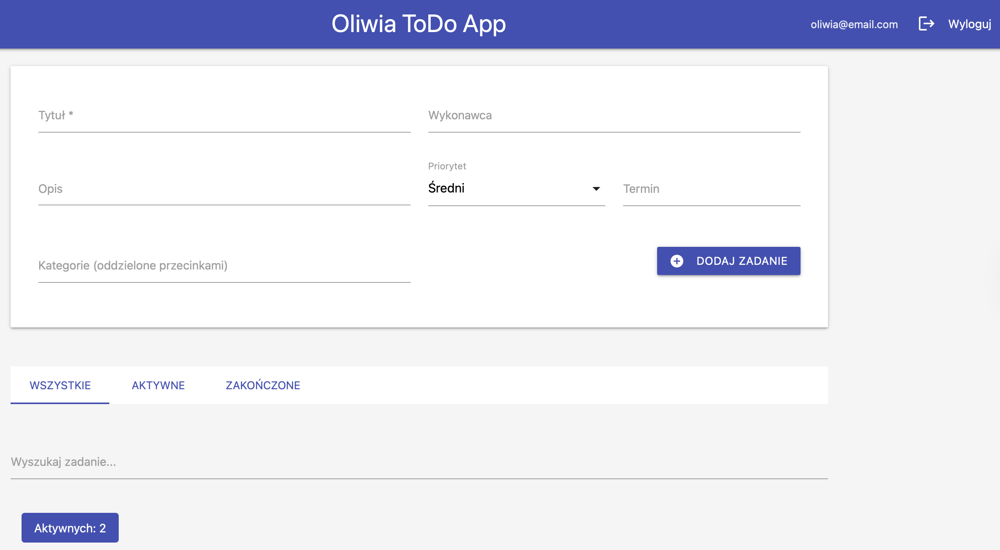
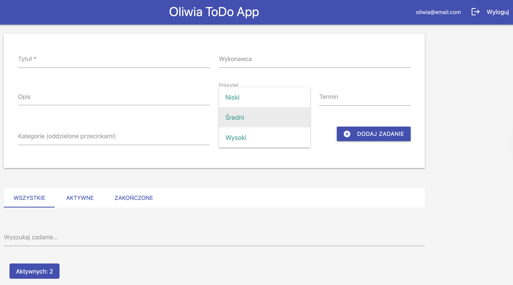
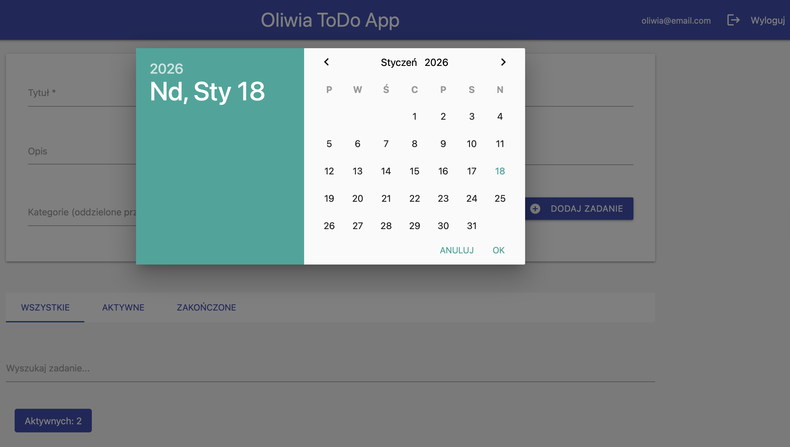
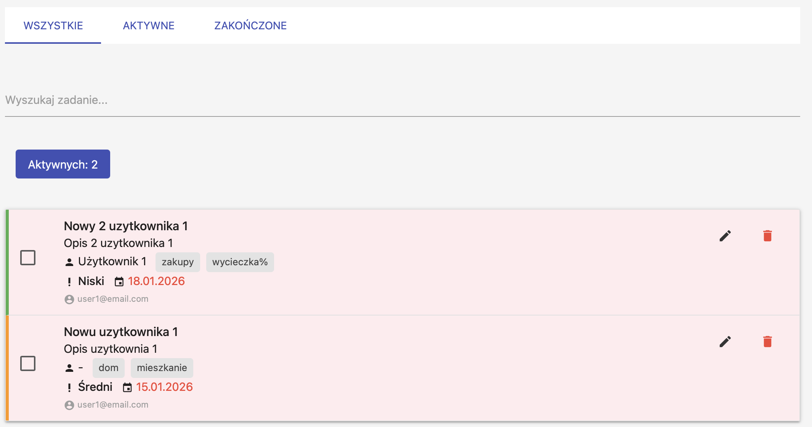

# Oliwia ToDo App - Aplikacja do zarządzania zadaniami

**Autor:** Oliwia Kołacz
**Data:** 09.11.2025

## Opis projektu
Aplikacja webowa do zarządzania zadaniami z bazą danych SQLite, autoryzacją sesyjną oraz rolami użytkowników (user/admin).

## Technologie
- Node.js
- Express.js
- SQLite (baza danych)
- express-session (autoryzacja)
- bcrypt (hashowanie haseł)
- Materialize CSS (frontend)

## Instalacja i uruchomienie

### Wymagania
- Node.js 18+

### Krok po kroku
```bash
# 1. Sklonuj repozytorium
git clone https://github.com/oliwiakolacz/zadanie-09112025.git

# 2. Przejdź do katalogu
cd zadanie-09112025

# 3. Zainstaluj zależności
npm install

# 4. Uruchom serwer
npm start
```

Serwer powinien być dostępny pod adresem: `http://localhost:3000`

Baza danych `database.sqlite` utworzy się automatycznie przy pierwszym uruchomieniu.

## Endpointy API

### Autoryzacja

#### POST /auth/register
Rejestracja nowego użytkownika.

```bash
curl -X POST http://localhost:3000/auth/register \
  -H "Content-Type: application/json" \
  -d '{"email":"user@example.com","password":"haslo123"}'
```

**Response (201):**
```json
{
  "message": "User created",
  "user": {
    "id": 1,
    "email": "user@example.com",
    "role": "user"
  }
}
```

#### POST /auth/login
Logowanie użytkownika (tworzy sesję).

```bash
curl -X POST http://localhost:3000/auth/login \
  -H "Content-Type: application/json" \
  -d '{"email":"user@example.com","password":"haslo123"}' \
  -c cookies.txt
```

**Response (200):**
```json
{
  "message": "Login successful",
  "user": {
    "id": 1,
    "email": "user@example.com",
    "role": "user"
  }
}
```

#### POST /auth/logout
Wylogowanie użytkownika.

```bash
curl -X POST http://localhost:3000/auth/logout -b cookies.txt
```

#### GET /auth/me
Pobiera dane aktualnie zalogowanego użytkownika.

```bash
curl http://localhost:3000/auth/me -b cookies.txt
```

### Zadania (Tasks)

Wszystkie endpointy wymagają zalogowania (sesji).

#### GET /tasks
Pobiera listę zadań. User widzi tylko swoje, admin widzi wszystkie.

```bash
curl http://localhost:3000/tasks -b cookies.txt
```

#### POST /tasks
Tworzy nowe zadanie przypisane do zalogowanego użytkownika.

```bash
curl -X POST http://localhost:3000/tasks \
  -H "Content-Type: application/json" \
  -d '{
    "title":"Nowe zadanie",
    "description":"Opis zadania",
    "assignee":"Jan Kowalski",
    "priority":"high",
    "deadline":"2025-01-20",
    "categories":"praca, pilne"
  }' \
  -b cookies.txt
```

**Pola zadania:**
| Pole | Typ | Wymagane | Opis |
|------|-----|----------|------|
| title | string | ✅ | Tytuł zadania |
| description | string | ❌ | Opis zadania |
| assignee | string | ❌ | Wykonawca |
| priority | string | ❌ | Priorytet: low, medium (domyślny), high |
| deadline | string | ❌ | Termin (format: YYYY-MM-DD) |
| categories | string | ❌ | Kategorie oddzielone przecinkami |

#### PUT /tasks/:id
Aktualizuje zadanie. User może edytować tylko swoje, admin wszystkie.

```bash
curl -X PUT http://localhost:3000/tasks/1 \
  -H "Content-Type: application/json" \
  -d '{"completed":true, "priority":"low"}' \
  -b cookies.txt
```

#### DELETE /tasks/:id
Usuwa zadanie. User może usuwać tylko swoje, admin wszystkie.

```bash
curl -X DELETE http://localhost:3000/tasks/1 -b cookies.txt
```

### Endpointy administracyjne

Dostępne tylko dla użytkowników z rolą `admin`.

#### GET /admin/users
Pobiera listę wszystkich użytkowników.

```bash
curl http://localhost:3000/admin/users -b cookies.txt
```

#### DELETE /admin/users/:id
Usuwa użytkownika wraz z jego zadaniami.

```bash
curl -X DELETE http://localhost:3000/admin/users/2 -b cookies.txt
```

### Pozostałe

#### GET /health
Sprawdza status API.

```bash
curl http://localhost:3000/health
```

## Uprawnienia

| Endpoint | User | Admin |
|----------|------|-------|
| POST /auth/register | ✓ | ✓ |
| POST /auth/login | ✓ | ✓ |
| POST /auth/logout | ✓ | ✓ |
| GET /auth/me | ✓ | ✓ |
| GET /tasks | tylko swoje | wszystkie |
| POST /tasks | ✓ | ✓ |
| PUT /tasks/:id | tylko swoje | wszystkie |
| DELETE /tasks/:id | tylko swoje | wszystkie |
| GET /admin/users | ✗ | ✓ |
| DELETE /admin/users/:id | ✗ | ✓ |

## Widoczność zadań

System rozróżnia dwa poziomy dostępu do zadań:

**Użytkownik (role: user):**
- Widzi tylko zadania, które sam utworzył
- Może edytować i usuwać tylko swoje zadania
- Nie ma dostępu do zadań innych użytkowników

**Administrator (role: admin):**
- Widzi wszystkie zadania w systemie
- Przy każdym zadaniu wyświetlany jest email właściciela
- Może edytować i usuwać zadania wszystkich użytkowników
- Ma dostęp do panelu administracyjnego (lista użytkowników, usuwanie kont)

## Baza danych

### Tabela users
| Kolumna | Typ | Opis |
|---------|-----|------|
| id | INTEGER | Klucz główny |
| email | TEXT | Unikalny email |
| password_hash | TEXT | Zahashowane hasło (bcrypt) |
| role | TEXT | 'user' lub 'admin' |
| created_at | DATETIME | Data utworzenia |

### Tabela tasks
| Kolumna | Typ | Opis |
|---------|-----|------|
| id | INTEGER | Klucz główny |
| title | TEXT | Tytuł zadania |
| description | TEXT | Opis (opcjonalny) |
| assignee | TEXT | Wykonawca (opcjonalny) |
| priority | TEXT | 'low', 'medium', 'high' |
| deadline | TEXT | Termin (opcjonalny) |
| categories | TEXT | Kategorie (opcjonalny) |
| completed | BOOLEAN | Status wykonania |
| user_id | INTEGER | ID właściciela (FK) |
| created_at | DATETIME | Data utworzenia |
| updated_at | DATETIME | Data modyfikacji |

## Nadanie roli administratora

Po rejestracji użytkownika, możesz nadać mu rolę admina:

```bash
sqlite3 back/database.sqlite
UPDATE users SET role = 'admin' WHERE email = 'admin@example.com';
.quit
```

Po zmianie roli użytkownik musi się ponownie zalogować.

## Struktura projektu

```
zadanie-09112025/
├── back/
│   ├── server.js
│   └── database.sqlite (generowany automatycznie)
├── front/
│   ├── app.js
│   ├── index.html
│   └── style.css
├── img/
│   ├── 0.png
│   ├── 1.png
│   ├── 2.png
│   ├── 3.png
│   └── 4.png
├── package.json
├── README.md
└── .gitignore
```

## Testowanie

API testowane za pomocą curl oraz Thunder Client (VS Code).

### Przykładowa sesja testowa:

```bash
# 1. Rejestracja
curl -X POST http://localhost:3000/auth/register \
  -H "Content-Type: application/json" \
  -d '{"email":"test@test.pl","password":"haslo123"}'

# 2. Logowanie (zapisz cookies)
curl -X POST http://localhost:3000/auth/login \
  -H "Content-Type: application/json" \
  -d '{"email":"test@test.pl","password":"haslo123"}' \
  -c cookies.txt

# 3. Dodaj zadanie
curl -X POST http://localhost:3000/tasks \
  -H "Content-Type: application/json" \
  -d '{
    "title":"Moje zadanie",
    "description":"Opis",
    "assignee":"Jan",
    "priority":"high",
    "deadline":"2025-01-25",
    "categories":"dom, zakupy"
  }' \
  -b cookies.txt

# 4. Pobierz zadania
curl http://localhost:3000/tasks -b cookies.txt

# 5. Oznacz jako wykonane
curl -X PUT http://localhost:3000/tasks/1 \
  -H "Content-Type: application/json" \
  -d '{"completed":true}' \
  -b cookies.txt

# 6. Wyloguj
curl -X POST http://localhost:3000/auth/logout -b cookies.txt
```


## Zrzuty ekranu









